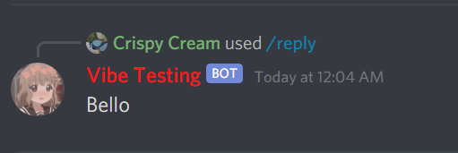
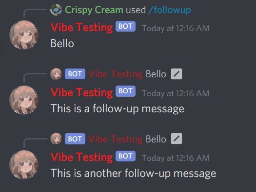
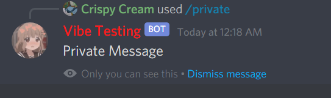
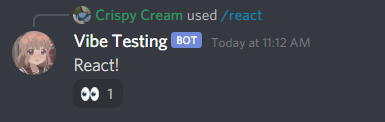

# Methods

## **Replying**

Responds to an interaction

```javascript
interaction.reply('Bello').then(console.log);
```

returns  &lt;Promise FInteraction&gt;

### **Example**

```javascript
//reply.js
module.exports = {
  name: 'reply',// Will default to filename if this is empty.
  description: 'Reply to the interaction',//Default: "An awesome command..!"
  guilds: ['789259215868395552'],  /*This is for guild specific command registration. If this is empty, the command will be registered globally*/
  async run({ interaction, client }) {
    interaction.reply('Bello').then(console.log); //Send the interaction message, then log it.
  }
}  

```



## **Edit**

Edits an interaction response which was sent using the `.reply()` method.

```javascript
interaction.reply('Bello').then(m => {
    m.edit("Pog");
}) 
```

### Example 

```javascript
//edit.js
module.exports = {
  name: 'edit',// Will default to filename if this is empty.
  description: 'Edit an interaction reply',//Default: "An awesome command..!"
  guilds: ['789259215868395552'],  /*This is for guild specific command registration. If this is empty, the command will be registered globally*/
  async run({ interaction, client }) {
    interaction.reply('Bello').then(m => { //Send the message.
      m.edit("Pog"); //edit the message.
    })
  }
}
```


## **Delete**

Deletes an interaction response that was sent using the `.reply()` method.

```javascript
interaction.reply('Bello').then(m => {
    setTimeout(() => {
        m.delete()
    }, 5000)
})
```

### Example

```javascript
//delete.js
module.exports = {
  name: 'delete',// Will default to filename if this is empty.
  description: 'Delete the message after 5000ms',//Default: "An awesome command..!"
  guilds: ['789259215868395552'],  /*This is for guild specific command registration. If this is empty, the command will be registered globally*/
  async run({ interaction, client }) {
    interaction.reply('Bello').then(m => { //Send the reply.
      setTimeout(() => { //Set timeout for 5000 ms.
        m.delete(); //Delete the message.
      }, 5000);
    })
  }
}
```

_No screenshot, because it deletes lol_

## Follow-up Messages

Follow-up messages allow you to send multiple messages from a single interaction. Here is an example.

```javascript
let m = await interaction.reply("Bello");
let i = await m.reply("This is a follow-up message");
i.reply("This is another follow-up message").then(console.log);
```

Follow-up messages and interaction responses work with a unique interaction token which is generated when an interaction is created. This unique token is only valid for 15 minutes. Then, interaction response/follow-up messages sent after that won't be successful.

### Example

```javascript
//followup.js
module.exports = {
  name: 'followup',// Will default to filename if this is empty.
  description: 'Follow-up to an interaction',//Default: "An awesome command..!"
  guilds: ['789259215868395552'],  /*This is for guild specific command registration. If this is empty, the command will be registered globally*/
  async run({ interaction, client }) {
    let m = await interaction.reply("Bello"); //Send the first message.
    let i = await m.reply("This is a follow-up message"); //Send the first Follow up message.
    i.reply("This is another follow-up message"); //Send another Follow up message.
  }
}
```



## Ephemeral Responses

Using flags we can create ephemeral \(private\) responses. Here is an example.

```javascript
interaction.reply("Ephemeral  Message", { flags: 64 })
```

This will only respond to the author of the interaction, find the [Docs here](https://canary.discord.com/developers/docs/interactions/slash-commands#interaction-response-interactionapplicationcommandcallbackdata)

### Example

```javascript
//private.js
module.exports = {
  name: 'private',// Will default to filename if this is empty.
  description: 'Private Response.',//Default: "An awesome command..!"
  guilds: ['789259215868395552'],  /*This is for guild specific command registration. If this is empty, the command will be registered globally*/
  async run({ interaction, client }) {
    interaction.reply("Private Message", { flags: 64 }) //Send the interaction message, but as a private message.
  }
}
```



## Reactions

With Shandler's newest update we can now react to messages.

```javascript
interaction.reply('bello').then(m => m.message.react('👀'))
```

### Example

```javascript
//react.js
module.exports = {
    guilds: ['826662403810131988'],
    name: 'react',
    async run({ interaction }) {
        interaction.reply("React!").then(m => {
            m.message.react('👀')
        })
    }
}
```



## Attachments

Using Discord.js MessageAttachments, we are able to send attachments in our interactions.

```javascript
interaction.reply("", { files: [attachment] });
```

### Example

```javascript
const Discord = require('discord.js')
const DIG = require("discord-image-generation");
module.exports = {
    name: 'circle',
    description: 'Make a PFP a circle',
    guilds: ['789259215868395552'],
    async run({ interaction, client }) {
        try {
            var avatar = interaction.user.displayAvatarURL({ dynamic: false, format: 'png' });
            
            let img = await new DIG.Circle().getImage(avatar);

            let attach = new Discord.MessageAttachment(img, "avatar.png");

            i.edit("", { files: [attach] });
        } catch (err) {
            console.log(err)
        }
    } 
}
```

